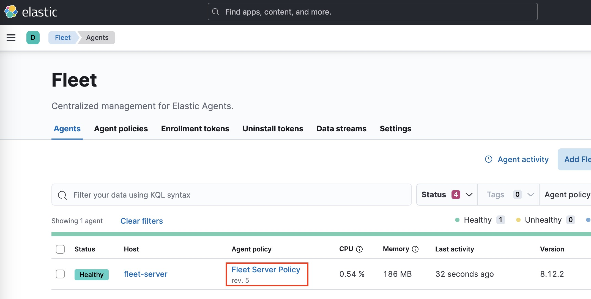
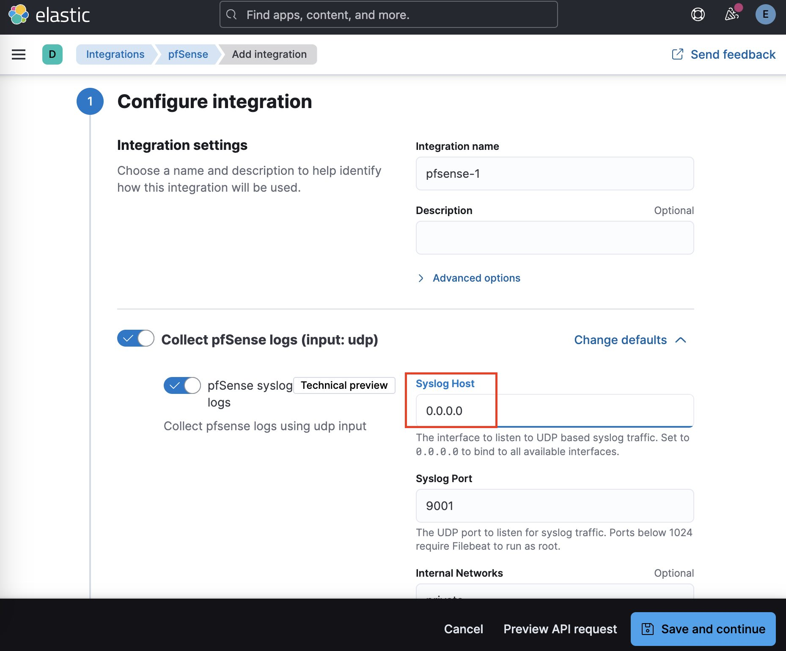
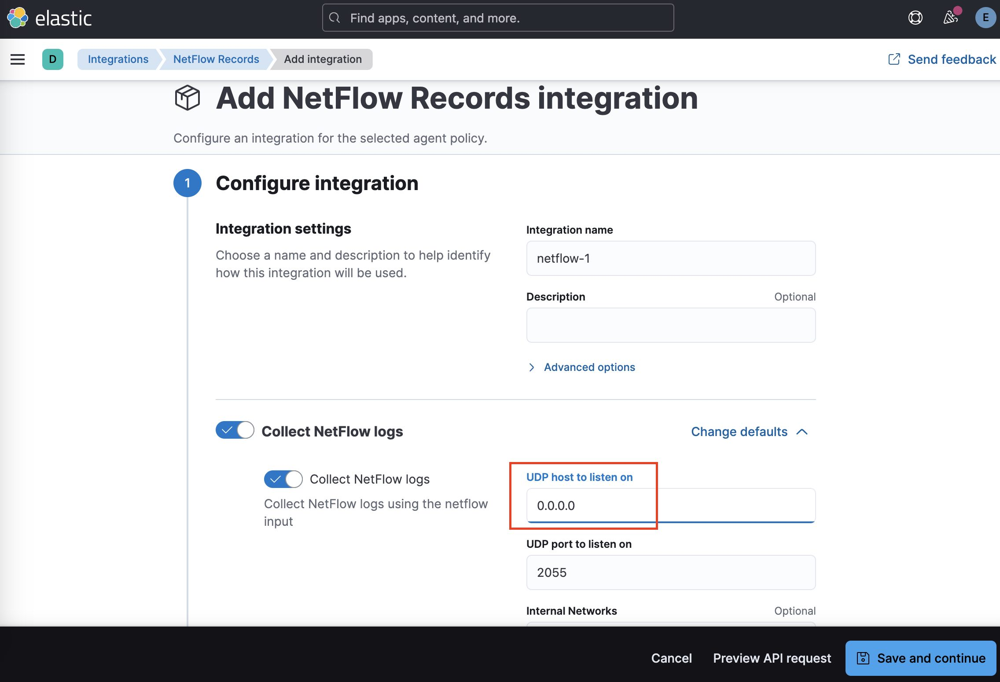
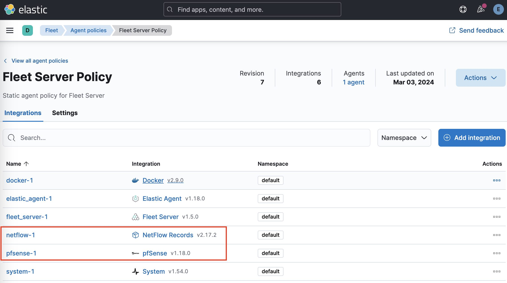

# Integrations

This document shows how to configure the `pfSense` and `NetFlow` integrations.

## pfSense

We will configure in Kibana the `pfSense` integration for receiving the opnsense syslogs.

1. Opense Kibana (http://yourhost:5601) and in the top search for `Fleet`. 
2. Once it opens, click the `Fleet Server Policy` of the only existing host

3. Click `Add Integration` and search for `pfSense`.
4. Click `+ Add pfSense`
5. Change the `host` to `0.0.0.0` and click `Save and Continue`

6. Click `Save and deploy changes`

## NetFlow Records

We will configure in Kibana the `Netflow Records` integration for receiving the opnsense NetFlow records.

1. Opense Kibana (http://yourhost:5601) and in the top search for `Fleet`. 
2. Once it opens, click the `Fleet Server Policy` of the only existing host

3. Click `Add Integration` and search for `Netflow Records`.
4. Click `+ Add Netflow Records`
5. Change the `host` to `0.0.0.0` and click `Save and Continue`

6. Click `Save and deploy changes`

## Result
You should have something like this:

