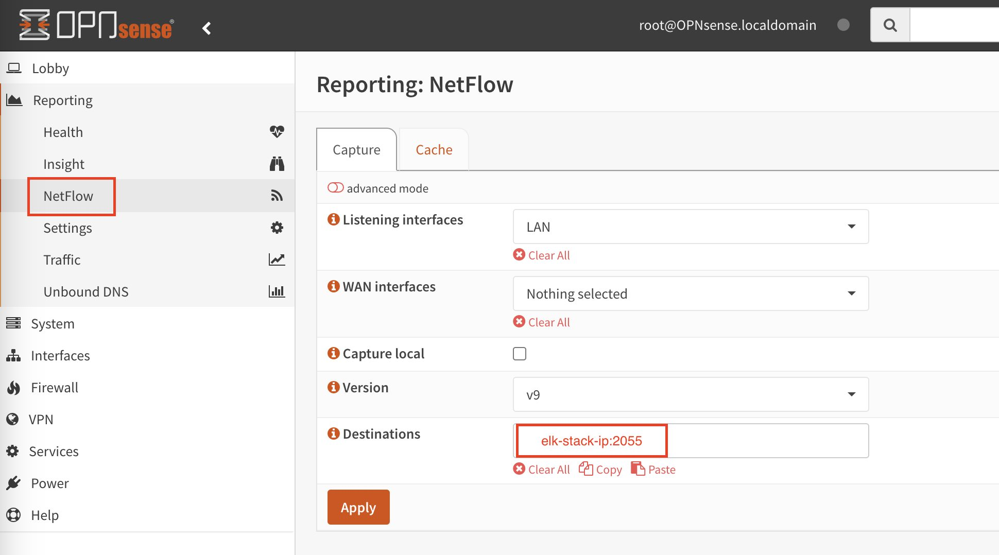
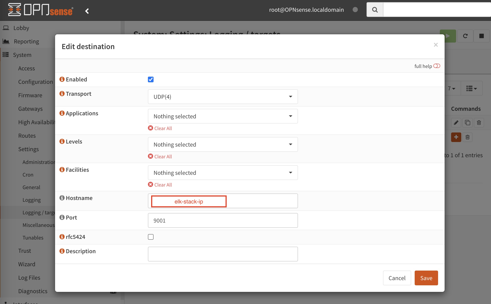

## opnsense configuration

We will configure our opnsense to send the logs to the ELK integrations.

## NetFlow

Enter the IP address/hostname in which the ELK stack is running and the `2055` port (port in which the `NetFlow Records` integration is running).\
Configure the parameters as needed.\
Remember to click `Apply`

## Syslog

Enter the IP address/hostname in which the ELK stack is running and the `9001` port (port in which the `pfSense` integration is running).\
Configure the parameters as needed.\
Remember to click `Apply`
